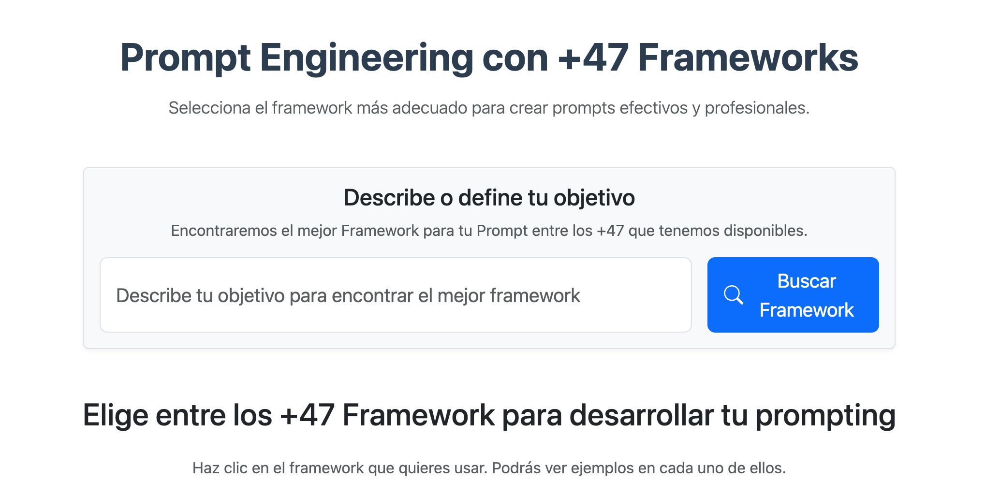
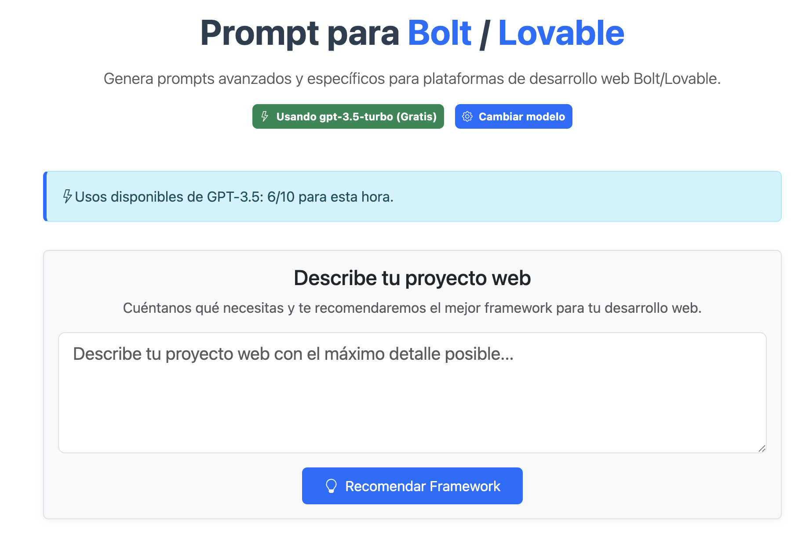
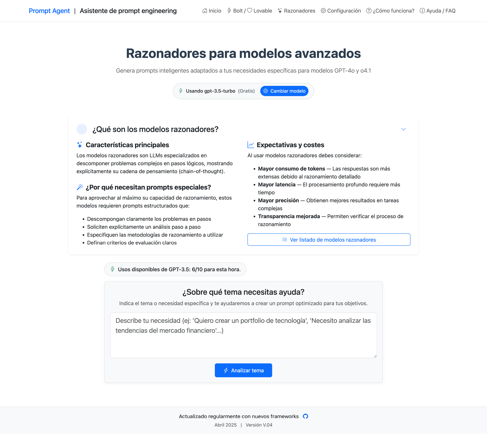
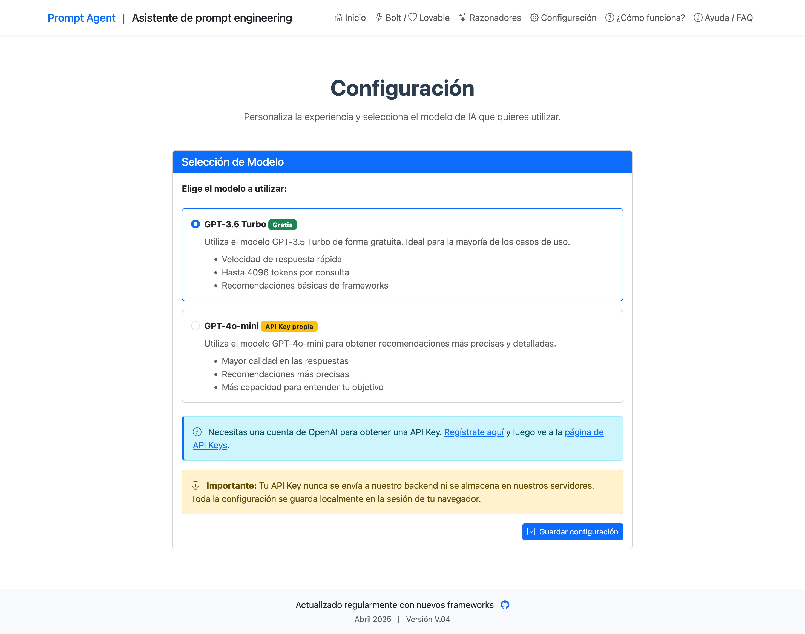
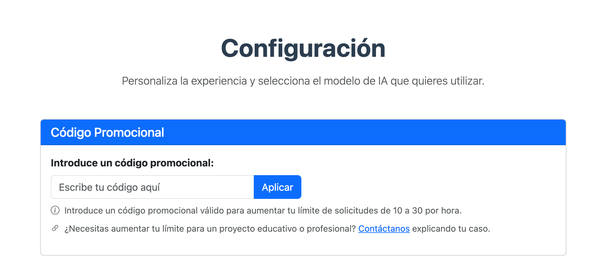

# 🚀 Prompt engineering framework generator

<div align="center">
  
</div>

Una aplicación web para generar prompts efectivos utilizando 75 frameworks especializados de prompt engineering.

## 🌟 Características

### 🤖 Sistema de recomendación inteligente
1. **Análisis de objetivo**: Escribe tu objetivo y el sistema lo analiza automáticamente
2. **Selección inteligente**: El sistema determina el framework más adecuado
3. **Explicación detallada**: Recibe el por qué se eligió ese framework
4. **Ejemplos prácticos**: Obtén ejemplos específicos para tu caso
5. **Generación guiada**: Asistencia paso a paso para crear tu prompt

### ⚡❤️ Generador Bolt/Lovable

<div align="center">
  
</div>

1. **Especificaciones detalladas**: Genera documentos completos para desarrollos web en plataformas Bolt/Lovable
2. **Diseño visual preciso**: Incluye paletas de colores, tipografía, espaciado y elementos UI
3. **Interacciones y animaciones**: Define comportamientos exactos para cada elemento interactivo
4. **Arquitectura de contenido**: Establece estructura jerárquica de páginas y secciones
5. **SEO y estrategia**: Incluye palabras clave, meta etiquetas y estructura recomendada
6. **Resultados profesionales**: Se aconseja usar API Key propia para resultados óptimos, aunque también funciona excelentemente con la versión gratuita

#### 🎨 Personalización estética

<div align="center">
  
</div>

Nueva funcionalidad que permite definir con precisión la estética de tu proyecto:

1. **Paleta de colores**: Define colores primarios, secundarios y de acento con selectores visuales
2. **Tipografía personalizada**: Selecciona fuentes para títulos y texto, tamaños y estilos tipográficos
3. **Elementos de diseño**: Configura estilos de componentes, densidad de información y efectos visuales
4. **Valores predeterminados**: Opción para aplicar valores estéticos predefinidos por Lovable
5. **Referencias visuales**: Incluye URLs de sitios de referencia e inspiración
6. **Integración completa**: Todos los detalles estéticos se incorporan automáticamente al prompt

Esta personalización estética permite obtener resultados mucho más precisos y alineados con la identidad visual deseada para el proyecto.

### 🧠 Prompts para modelos razonadores

<div align="center">
  
</div>

La sección de Razonadores está diseñada para crear prompts extremadamente detallados y estructurados que potencian las capacidades de razonamiento profundo de modelos de lenguaje avanzados como GPT-4o y Gemini.

1. **Análisis detallado de temas**: Proporciona un tema y el sistema generará automáticamente preguntas personalizadas para extraer información crucial
2. **Preguntas de refinamiento**: Responde a preguntas específicas generadas por la IA para clarificar detalles clave sobre tu tema
3. **Prompt ultradetallado**: Obtén un prompt con 15-20 puntos de instrucción (tres veces más completo que un prompt estándar)
4. **Estructura optimizada**: El prompt generado incluye secciones, subsecciones, numeración, viñetas y énfasis (negritas, cursivas)
5. **Criterios de evaluación**: Cada prompt incluye métricas específicas para evaluar la calidad de la respuesta
6. **Razonamiento sistemático**: Diseñado para extraer el razonamiento paso a paso de los modelos más avanzados

El modo Razonador funciona siguiendo estos pasos:
1. Ingresa el tema o problema sobre el que necesitas un análisis profundo
2. El sistema analiza el tema y genera preguntas personalizadas para obtener más contexto
3. Responde a estas preguntas para proporcionar información crucial
4. El sistema genera un prompt ultradetallado optimizado para obtener el mejor razonamiento posible
5. Utiliza este prompt con modelos avanzados para obtener análisis sistemáticos y profundos

Para obtener resultados óptimos se recomienda utilizar una API Key propia configurada para acceder a modelos más potentes como GPT-4o, aunque también funciona con GPT-4o-mini.

### 🧠 Modelos de IA disponibles
- **GPT-4o-mini (Gratis)**: Disponible para todos los usuarios sin coste
  - Recomendaciones de frameworks precisas
  - Respuestas de alta calidad
  - Hasta 4000 tokens por consulta
  - Limitado a 10 solicitudes por hora (para uso gratuito)
- **GPT-4o (API Key propia)**: Para usuarios que desean resultados premium
  - Recomendaciones más precisas y detalladas
  - Mayor comprensión del contexto
  - Requiere tu propia API Key de OpenAI
  - Sin límites de uso (depende de tu plan de OpenAI)
  - Configuración simple a través del panel de configuración
  - La API Key nunca se almacena en el servidor, solo en la sesión del navegador

### 📚 Frameworks disponibles

> Todos los frameworks están disponibles como archivos de texto en la carpeta `static/frameworks/prompt-frameworks/` del repositorio, donde se encuentran detallados con ejemplos y estructuras completas.

| Framework | Componentes | Ideal para |
|-----------|-------------|------------|
| **[RTF](static/frameworks/prompt-frameworks/RTF-Rol-Tarea-Formato.txt)**   | Role, Task, Format | Generación de contenido estructurado y tareas específicas. |
| **[PARA](static/frameworks/prompt-frameworks/PARA-Problema-Aproximacion-Razon-Accion.txt)**  | Purpose, Action, Result, Assessment | Planificación y evaluación de proyectos. |
| **[SMART](static/frameworks/prompt-frameworks/SMART-Especifico-Medible-Alcanzable-Relevante-Temporal.txt)** | Specific, Measurable, Achievable, Relevant, Time‑bound | Definición de objetivos y metas. |
| **[ERQ](static/frameworks/prompt-frameworks/ERQ-Experiencia-Requisitos-Cualificaciones.txt)**   | Experience, Requirements, Qualifiers | Definición de perfiles y requisitos. |
| **[CODE](static/frameworks/prompt-frameworks/CODE-Contexto-Objetivo-Detalles-Ejemplos.txt)**  | Context, Objective, Details, Examples | Documentación técnica y guías. |
| **[PROS](static/frameworks/prompt-frameworks/PROS-Perspectiva-Requisitos-Resultado-Solucion.txt)**  | Perspective, Requirements, Outcome, Scope | Planificación de proyectos. |
| **[TEAM](static/frameworks/prompt-frameworks/TEAM-Tarea-Entorno-Aproximacion-Metricas.txt)**  | Task, Environment, Approach, Metrics | Trabajo en equipo y colaboración. |
| **[IDEA](static/frameworks/prompt-frameworks/IDEA-Identificar-Definir-Ejecutar-Analizar.txt)**  | Identify, Define, Execute, Assess | Resolución de problemas. |
| **[CARE](static/frameworks/prompt-frameworks/CARE-Contexto-Accion-Resultado-Ejemplo.txt)**  | Context, Action, Result, Example | Instrucciones detalladas y aprendizaje. |
| **[RISE](static/frameworks/prompt-frameworks/RISE-Relevancia-Informacion-Solucion-Evaluacion.txt)**  | Role, Input, Steps, Expectation | Procesos y flujos de trabajo. |
| **[LOGIC](static/frameworks/prompt-frameworks/LOGIC-Diseno-Objetivo-Directrices-Implementacion-Criterios.txt)** | Layout, Objective, Guidelines, Implementation, Criteria | Desarrollo de sistemas y procesos. |
| **[SCOPE](static/frameworks/prompt-frameworks/SCOPE-Situacion-Necesidad-Obstaculos-Plan-Evaluacion.txt)** | Situation, Core Need, Obstacles, Plan, Evaluation | Definición y gestión de alcance. |
| **[FOCUS](static/frameworks/prompt-frameworks/FOCUS-Marco-Objetivo-Restricciones-Comprension-Solucion.txt)** | Frame, Objective, Constraints, Understanding, Solution | Resolución estructurada de problemas. |
| **[CLARITY](static/frameworks/prompt-frameworks/CLARITY-Contexto-Limitaciones-Aproximacion-Requisitos-Implementacion-Cronograma-Rendimiento.txt)** | Context, Limitations, Approach, Requirements, Implementation, Timeline, Yield | Gestión de proyectos complejos y migraciones. |
| **[EXPERT](static/frameworks/prompt-frameworks/EXPERT-Experiencia-Contexto-Proposito-Ejecucion-Resultados-Pruebas.txt)** | Expertise, Context, Purpose, Execution, Results, Testing | Proyectos técnicos especializados. |
| **[GUIDE](static/frameworks/prompt-frameworks/GUIDE-Meta-Usuario-Implementacion-Entrega-Evaluacion.txt)** | Goal, User, Implementation, Delivery, Evaluation | Desarrollo de productos y servicios. |
| **[PATH](static/frameworks/prompt-frameworks/PATH-Proposito-Aproximacion-Objetivo-Horizonte.txt)**  | Purpose, Approach, Target, Horizon | Planificación estratégica. |
| **[LEARN](static/frameworks/prompt-frameworks/LEARN-Nivel-Experiencia-Aproximacion-Recursos-SiguientesPasos.txt)** | Level, Experience, Approach, Resources, Next steps | Planes de formación y desarrollo. |
| **[SOLVE](static/frameworks/prompt-frameworks/SOLVE-Situacion-Opciones-Limitaciones-Verificacion-Ejecucion.txt)** | Situation, Options, Limitations, Verification, Execution | Resolución de problemas complejos. |
| **[PRIME](static/frameworks/prompt-frameworks/PRIME-Problema-Investigacion-Implementacion-Monitoreo-Evaluacion.txt)** | Problem, Research, Implementation, Monitoring, Evaluation | Proyectos de investigación y desarrollo. |
| **[ADAPT](static/frameworks/prompt-frameworks/ADAPT-Analisis-Diseno-Aproximacion-Progreso-Pruebas.txt)** | Analysis, Design, Approach, Progress, Testing | Proyectos adaptativos y ágiles. |
| **[BUILD](static/frameworks/prompt-frameworks/BUILD-LineaBase-Entendimiento-Implementacion-Aprendizaje-Entrega.txt)** | Baseline, Understanding, Implementation, Learning, Delivery | Desarrollo de nuevos productos o servicios. |
| **[CRAFT](static/frameworks/prompt-frameworks/CRAFT-Contexto-Requisitos-Aproximacion-Funcionalidades-Pruebas.txt)** | Context, Requirements, Approach, Features, Testing | Desarrollo de soluciones a medida. |
| **[SCALE](static/frameworks/prompt-frameworks/SCALE-Estrategia-Capacidades-Accion-Aprendizaje-Evolucion.txt)** | Strategy, Capabilities, Action, Learning, Evolution | Escalamiento de proyectos y operaciones. |
| **[THINK](static/frameworks/prompt-frameworks/THINK-Tema-Historia-Insights-SiguientesPasos-Conocimiento.txt)** | Topic, History, Insights, Next steps, Knowledge | Análisis estratégico y toma de decisiones. |
| **[GROW](static/frameworks/prompt-frameworks/GROW-Meta-Realidad-Opciones-Camino.txt)**  | Goal, Reality, Options, Way Forward | Coaching y desarrollo personal. |
| **[QUEST](static/frameworks/prompt-frameworks/QUEST-Pregunta-Entendimiento-Exploracion-Solucion-Pruebas.txt)** | Question, Understanding, Exploration, Solution, Testing | Investigación y resolución de problemas. |
| **[DRIVE](static/frameworks/prompt-frameworks/DRIVE-Direccion-Recursos-Implementacion-Validacion-Evolucion.txt)** | Direction, Resources, Implementation, Validation, Evolution | Gestión de proyectos innovadores. |
| **[SHAPE](static/frameworks/prompt-frameworks/SHAPE-Situacion-Historia-Analisis-Plan-Ejecucion.txt)** | Situation, History, Analysis, Plan, Execution | Transformación organizacional. |
| **[REACH](static/frameworks/prompt-frameworks/REACH-Requisitos-Evaluacion-Aproximacion-Completitud-Handover.txt)** | Requirements, Evaluation, Approach, Completion, Handover | Gestión de proyectos end-to-end. |
| **[BLEND](static/frameworks/prompt-frameworks/BLEND-Base-Aprendizaje-Evolucion-Navegacion-Entrega.txt)** | Baseline, Learning, Evolution, Navigation, Delivery | Proyectos híbridos y metodologías mixtas. |
| **[SPARK](static/frameworks/prompt-frameworks/SPARK-Estrategia-Planificacion-Accion-Resultados-Conocimiento.txt)** | Strategy, Planning, Action, Results, Knowledge | Iniciativas de innovación. |
| **[PULSE](static/frameworks/prompt-frameworks/PULSE-Proposito-Entendimiento-Aprendizaje-Estrategia-Evaluacion.txt)** | Purpose, Understanding, Learning, Strategy, Evaluation | Monitoreo y mejora continua. |
| **[FAST](static/frameworks/prompt-frameworks/FAST-Enfoque-Audiencia-Alcance-Tono.txt)**  | Focus, Audience, Scope, Tone | Documentación técnica y guías de usuario. |
| **[T-A-G](static/frameworks/prompt-frameworks/TAG-Tarea-Accion-Meta.txt)** | Tarea, Acción, Meta | Proyectos con objetivos medibles y acciones concretas. |
| **[B-A-B](static/frameworks/prompt-frameworks/BAB-Antes-Despues-Puente.txt)** | Antes, Después, Puente | Mostrar cambios y mejoras con un plan claro. |
| **[P-E-A-S](static/frameworks/prompt-frameworks/PEAS-Proposito-Resultado-Audiencia-Estilo.txt)** | Propósito, Resultado, Audiencia, Estilo | Estrategias de comunicación y marketing. |
| **[S-T-A-R](static/frameworks/prompt-frameworks/STAR-Situacion-Tarea-Accion-Resultado.txt)** | Situación, Tarea, Acción, Resultado | Documentar logros y experiencias. |
| **[Q-C-Q-A](static/frameworks/prompt-frameworks/QCQA-Pregunta-Contexto-Calificacion-Formato.txt)** | Pregunta, Contexto, Calificación, Respuesta | Consultas estructuradas para resolver problemas paso a paso. |
| **[A-I-D-A](static/frameworks/prompt-frameworks/AIDA-Atencion-Interes-Deseo-Accion.txt)** | Atención, Interés, Deseo, Acción | Marketing persuasivo y creación de campañas. |
| **[L-E-A-P](static/frameworks/prompt-frameworks/LEAP-Nivel-Expectativas-Aproximacion-Parametros.txt)** | Nivel, Expectativas, Enfoque, Parámetros | Planificación estratégica. |
| **[S-P-I-N](static/frameworks/prompt-frameworks/SPIN-Situacion-Problema-Implicacion-Necesidad.txt)** | Situación, Problema, Implicación, Necesidad | Ventas consultivas y negociación. |
| **[D-E-S-I-G-N](static/frameworks/prompt-frameworks/DESIGN-Definir-Explorar-Alcance-Idear-Guiar-Reducir.txt)** | Define, Explore, Scope, Ideate, Guide, Narrow | Procesos de diseño y desarrollo. |
| **[V-I-S-I-O-N](static/frameworks/prompt-frameworks/VISION-Visualizar-Identificar-Estructurar-Implementar-Optimizar-Navegar.txt)** | Visualize, Identify, Structure, Implement, Optimize, Navigate | Planificación estratégica. |
| **[I-M-P-A-C-T](static/frameworks/prompt-frameworks/IMPACT-Intencion-Mensaje-Proposito-Audiencia-Canal-Tiempo.txt)** | Intent, Message, Purpose, Audience, Channel, Timing | Estrategias de comunicación. |
| **[M-A-S-T-E-R](static/frameworks/prompt-frameworks/MASTER-Mision-Aproximacion-Estrategia-Tacticas-Ejecucion-Revision.txt)** | Mission, Approach, Strategy, Tactics, Execution, Review | Gestión de proyectos. |
| **[P-O-W-E-R](static/frameworks/prompt-frameworks/POWER-Problema-Resultado-PorQue-Ejecucion-Recursos.txt)** | Problem, Outcome, Why, Execution, Resources | Resolución de problemas. |
| **[C-R-E-A-T-E](static/frameworks/prompt-frameworks/CREATE-Contexto-Requisitos-Ejemplos-Alternativas-Pruebas-Evaluacion.txt)** | Context, Requirements, Examples, Alternatives, Testing, Evaluation | Procesos creativos y desarrollo de soluciones. |
| **[F-L-O-W](static/frameworks/prompt-frameworks/FLOW-Enfoque-Limites-Resultados-Trabajo.txt)** | Focus, Limits, Outcomes, Work | Optimización de procesos y productividad. |
| **[B-O-L-T](static/frameworks/prompt-frameworks/BOLT-Negocio-Operaciones-Legal-Tecnico.txt)** | Business, Operations, Legal, Technical | Análisis empresarial integral. |
| **[P-A-C-E](static/frameworks/prompt-frameworks/PACE-Proposito-Audiencia-Contenido-Expresion.txt)** | Purpose, Audience, Content, Expression | Comunicación efectiva y presentaciones. |
| **[A-G-I-L-E](static/frameworks/prompt-frameworks/AGILE-Adaptable-Orientado-Iterativo-Ligero-Eficiente.txt)** | Adaptable, Goal-oriented, Iterative, Lightweight, Efficient | Desarrollo ágil y gestión de proyectos. |
| **[S-E-E-D](static/frameworks/prompt-frameworks/SEED-Situacion-Expectativa-Ejecucion-Entrega.txt)** | Situation, Expectation, Execution, Delivery | Implementación de proyectos desde cero. |
| **[S-H-I-F-T](static/frameworks/prompt-frameworks/SHIFT-Situacion-Obstaculos-Innovacion-Marco-Transicion.txt)** | Situation, Hurdles, Innovation, Framework, Transition | Gestión del cambio y transformación. |
| **[L-I-F-T](static/frameworks/prompt-frameworks/LIFT-Aprendizaje-Implementacion-Retroalimentacion-Transformacion.txt)** | Learning, Implementation, Feedback, Transformation | Mejora continua y aprendizaje. |
| **[P-A-T-H-S](static/frameworks/prompt-frameworks/PATHS-Problema-Alternativas-Compensaciones-Hipotesis-Solucion.txt)** | Problem, Alternatives, Tradeoffs, Hypothesis, Solution | Toma de decisiones complejas. |
| **[F-A-S-T-E-R](static/frameworks/prompt-frameworks/FASTER-Enfoque-Analisis-Solucion-Prueba-Evaluacion-Refinamiento.txt)** | Focus, Analysis, Solution, Testing, Evaluation, Refinement | Desarrollo rápido y optimización. |
| **[V-A-L-U-E](static/frameworks/prompt-frameworks/VALUE-Vision-Aproximacion-Aprovechamiento-Comprension-Ejecucion.txt)** | Vision, Approach, Leverage, Understanding, Execution | Creación de valor empresarial. |
| **[S-M-A-R-T-E-R](static/frameworks/prompt-frameworks/SMARTER-Especifico-Medible-Alcanzable-Relevante-Temporal-Evaluar-Reevaluar.txt)** | Specific, Measurable, Achievable, Relevant, Time-bound, Evaluate, Reassess | Definición y seguimiento de objetivos. |
| **[G-R-I-T](static/frameworks/prompt-frameworks/GRIT-Meta-Recursos-Impedimentos-Tiempo.txt)** | Goal, Resources, Impediments, Timeline | Gestión de proyectos con objetivos desafiantes. |
| **[G-L-I-D-E](static/frameworks/prompt-frameworks/GLIDE-Meta-Limitaciones-Implementacion-Desarrollo-Evaluacion.txt)** | Goal, Limitations, Implementation, Development, Evaluation | Desarrollo de productos de forma eficiente. |
| **[P-I-V-O-T](static/frameworks/prompt-frameworks/PIVOT-Problema-Investigacion-Verificacion-Oportunidad-Transformacion.txt)** | Problem, Investigation, Verification, Opportunity, Transformation | Adaptación y gestión del cambio. |
| **[E-P-I-C](static/frameworks/prompt-frameworks/EPIC-Expectativa-Plan-Implementacion-Completacion.txt)** | Expectation, Plan, Implementation, Completion | Gestión de proyectos con entregables claros. |
| **[SCQA](static/frameworks/prompt-frameworks/SCQA-Situacion-Complicacion-Pregunta-Respuesta.txt)** | Situation, Complication, Question, Answer | Comunicación persuasiva y presentaciones. |
| **[SOAR](static/frameworks/prompt-frameworks/SOAR-Fortalezas-Oportunidades-Aspiraciones-Resultados.txt)** | Strengths, Opportunities, Aspirations, Results | Planificación estratégica positiva. |
| **[CFT](static/frameworks/prompt-frameworks/CFT-Contexto-Foco-Transformacion.txt)** | Context, Focus, Transformation | Gestión del cambio y transformaciones. |
| **[TAR](static/frameworks/prompt-frameworks/TAR-Disparador-Accion-Resultado.txt)** | Trigger, Action, Result | Análisis conductual y cambio de hábitos. |
| **[PACE](static/frameworks/prompt-frameworks/PACE-ObjetivoPrincipal-Alternativas-Consecuencias-Entorno.txt)** | Primary goal, Alternatives, Consequences, Environment | Toma de decisiones complejas. |
| **[FAB](static/frameworks/prompt-frameworks/FAB-Caracteristicas-Ventajas-Beneficios.txt)** | Features, Advantages, Benefits | Marketing y comunicación de producto. |
| **[AOR](static/frameworks/prompt-frameworks/AOR-Accion-Resultado-Reflexion.txt)** | Action, Outcome, Reflection | Aprendizaje experiencial y mejora. |
| **[SPQA](static/frameworks/prompt-frameworks/SPQA-Situacion-Problema-Pregunta-Respuesta.txt)** | Situation, Problem, Question, Answer | Resolución estructurada de problemas. |
| **[SARA](static/frameworks/prompt-frameworks/SARA-Shock-Enojo-Resistencia-Aceptacion.txt)** | Shock, Anger, Resistance, Acceptance | Gestión del cambio y transiciones. |
| **[GEAR](static/frameworks/prompt-frameworks/GEAR-Meta-Ejecutar-Evaluar-Reflexionar.txt)** | Goal, Execute, Assess, Reflect | Mejora continua y ciclos de aprendizaje. |
| **[BRIDGE](static/frameworks/prompt-frameworks/BRIDGE-Antecedentes-Razon-Informacion-Decision-Meta-Evaluacion.txt)** | Background, Reason, Information, Decision, Goal, Evaluation | Comunicaciones corporativas y cambios organizacionales. |
| **[CLEAR](static/frameworks/prompt-frameworks/CLEAR-Conectar-Escuchar-Explorar-Accion-Reflexionar.txt)** | Connect, Listen, Explore, Action, Reflect | Comunicación interpersonal y coaching. |

### 🛠️ Características técnicas
- **Generación de prompts**: Creación automática según el framework seleccionado
- **Exportación flexible**: Opciones para copiar en markdown o texto formateado
- **Contador de tokens**: Monitorización en tiempo real del uso de tokens
- **Sistema de limitación de tasa**: Control de uso para el modelo gratuito (10 solicitudes/hora)
- **Interfaz responsiva**: Diseño adaptable para cualquier dispositivo
- **Selección de modelos**: Opción para usar GPT-4o-mini (gratis) o GPT-4o (con API key propia)
- **Almacenamiento local**: Guarda tus prompts favoritos
- **Ejemplos interactivos**: Biblioteca de casos de uso para cada framework
- **Configuración de privacidad**: Las API Keys nunca se almacenan en el servidor, solo en la sesión del navegador
- **Formulario de contacto**: Sistema de contacto integrado usando Resend para el envío de emails
- **Analítica web**: Seguimiento de uso mediante Google Analytics para mejorar la experiencia
- **Banner de consentimiento de cookies**: Sistema compacto para gestionar el consentimiento de cookies esenciales y de análisis (Google Analytics)

## 🛠️ Tecnologías

- **Backend**: Python 3.9+ con Flask
- **IA**: OpenAI GPT-4o-mini (gratis) o GPT-4o (con API key propia)
- **Frontend**: HTML5, CSS3, JavaScript
- **Estilos**: Bootstrap 5
- **Documentación**: Markdown
- **Despliegue**: Gunicorn

## 📋 Requisitos Previos

- Python 3.9 o superior
- Cuenta de OpenAI con API key
- pip (gestor de paquetes de Python)

## 🚀 Instalación

1. Clona el repositorio:

```bash
git clone https://github.com/686f6c61/prompt-engineering-frameworks.git
cd prompt-engineering-frameworks
```
2. Crea y activa un entorno virtual:

```bash
python3 -m venv venv
source venv/bin/activate  # En Windows: venv\Scripts\activate
```

3. Instala las dependencias:

```bash
pip install -r requirements.txt
```

4. Configura las variables de entorno:

```bash
# Crea un archivo .env con las siguientes variables
OPENAI_API_KEY=tu_clave_de_api_de_openai
FLASK_SECRET_KEY=una_clave_secreta_para_flask
RESEND_API_KEY=tu_clave_de_api_de_resend
FLASK_ENV=development
PORT=5000
EMAIL_FROM=onboarding@resend.dev
EMAIL_TO=tu_email@example.com
GOOGLE_ANALYTICS_ID=tu_id_de_google_analytics
```

5. Ejecuta la aplicación:

```bash
python main.py
```
### 📚 Descripción de los componentes

- **app.py**: Punto de entrada de la aplicación Flask, maneja las rutas y la lógica principal
- **requirements.txt**: Lista de dependencias Python necesarias para el proyecto
- **.env**: Archivo de configuración con variables de entorno sensibles
- **static/**: Directorio para archivos estáticos
  - **css/**: Hojas de estilo personalizadas
  - **js/**: Scripts de JavaScript para la interactividad
    - **main.js**: Funcionalidad principal para los 47 frameworks
    - **bolt_lovable.js**: Lógica específica para el generador Bolt/Lovable
  - **img/**: Recursos gráficos
- **templates/**: Plantillas HTML de Jinja2
  - **base.html**: Plantilla base con estructura común
  - **index.html**: Página principal con los frameworks
  - **bolt_lovable.html**: Interfaz para el generador de especificaciones Bolt/Lovable
  - **ayuda_faq.html**: Documentación, guía de uso y preguntas frecuentes
- **utils/**: Módulos de utilidad
  - **openai_helper.py**: Funciones para interactuar con la API de OpenAI
  - **bolt_lovable_helper.py**: Funciones específicas para generar especificaciones detalladas para Bolt/Lovable
  - **prompt_formatter.py**: Utilidades para formatear los prompts generados
  - **rate_limiter.py**: Control de límites de uso de la API

## 📊 frameworks.json: Estructura para la escalabilidad

La aplicación utiliza un archivo central `static/frameworks/frameworks.json` que contiene toda la información estructurada de los frameworks disponibles. Este archivo es fundamental para la escalabilidad de la aplicación, ya que permite:

1. **Agregar nuevos frameworks fácilmente** sin modificar el código principal
2. **Centralizar toda la información** de los frameworks en un solo lugar
3. **Mantener coherencia** entre la interfaz de usuario y la lógica de procesamiento

### Estructura del archivo frameworks.json

```json
[
  {
    "nombre_completo": "GUIDE (Meta-Usuario-Implementación-Entrega-Evaluación)",
    "acronimo": "GUIDE",
    "significado_acronimo": [
      "Meta (Goal)",
      "Usuario",
      "Implementación",
      "Entrega (Delivery)",
      "Evaluación"
    ],
    "componentes": [
      {"nombre": "Meta (Goal)", "descripcion": "Define el objetivo principal y los resultados deseados"},
      {"nombre": "Usuario", "descripcion": "Identifica a los usuarios o stakeholders y sus necesidades específicas"},
      {"nombre": "Implementación", "descripcion": "Detalla cómo se desarrollará o construirá la solución"},
      {"nombre": "Entrega (Delivery)", "descripcion": "Especifica cómo se desplegará o entregará el producto final"},
      {"nombre": "Evaluación", "descripcion": "Establece cómo se medirá el éxito y se recogerá feedback"}
    ],
    "descripcion_proposito": "El framework GUIDE proporciona una estructura centrada en el usuario para el desarrollo y entrega de productos y servicios...",
    "ejemplo_uso": {
      "Meta": "Lanzar MVP en 2 meses",
      "Usuario": "Equipo de desarrollo",
      "Implementación": "Definir requisitos y prototipos",
      "Entrega": "Desplegar versión beta",
      "Evaluación": "Recoger feedback y métricas de uso"
    },
    "casos_recomendados": [
      "Desarrollo de productos centrados en el usuario",
      "Lanzamiento de nuevas funcionalidades o servicios",
      "Proyectos de mejora de experiencia de usuario"
    ],
    "ventajas": [
      "Mantiene el foco en las necesidades reales de los usuarios",
      "Proporciona un enfoque equilibrado entre objetivos, implementación y evaluación",
      "Establece un ciclo completo desde la definición hasta el feedback"
    ]
  },
  // Más frameworks...
]
```

### Cómo extender la aplicación con nuevos frameworks

Para añadir un nuevo framework a la aplicación:

1. **Crear los archivos de texto**: Añadir el nuevo framework como archivo `.txt` en la carpeta `frameworks/`
2. **Actualizar frameworks.json**: Agregar una nueva entrada en el archivo JSON siguiendo la estructura mostrada
3. **Regenerar el archivo ZIP**: Actualizar `static/frameworks/prompt-frameworks.zip` incluyendo el nuevo archivo de texto
4. **Actualizar la interfaz**: La aplicación detectará automáticamente el nuevo framework desde el JSON

### Uso programático de frameworks.json

El archivo puede ser consumido mediante una simple petición HTTP:

```javascript
// Ejemplo de cómo obtener los frameworks en JavaScript
fetch('/static/frameworks/frameworks.json')
  .then(response => response.json())
  .then(data => {
    // Trabajar con los datos de frameworks
    console.log(`Frameworks disponibles: ${data.length}`);
    // Filtrar frameworks por caso de uso
    const frameworksParaProductos = data.filter(f => 
      f.casos_recomendados.some(caso => caso.includes("producto"))
    );
  });
```

También está disponible una versión en CSV (`static/frameworks/frameworks.csv`) para integración con herramientas de análisis de datos o hojas de cálculo.

## 🔧 Configuración

La aplicación utiliza las siguientes variables de entorno:

- `OPENAI_API_KEY`: Tu clave de API de OpenAI
- `FLASK_SECRET_KEY`: Clave secreta para la seguridad de Flask
- `RESEND_API_KEY`: Clave de API de Resend para el envío de correos
- `FLASK_ENV`: Entorno de Flask (development/production)
- `PORT`: Puerto para el servidor (por defecto 8000)
- `GOOGLE_ANALYTICS_ID`: ID de seguimiento de Google Analytics (Ej: G-XXXXXXXXXX)

### Configuración del seguimiento analítico

La aplicación utiliza Google Analytics para el seguimiento analítico. Para configurarlo:

1. Obtén tu ID de seguimiento de Google Analytics
2. Configura la variable de entorno `GOOGLE_ANALYTICS_ID` en tu archivo `.env`:
   ```
   GOOGLE_ANALYTICS_ID=G-XXXXXXXXXX
   ```
3. Si no se proporciona esta variable, el seguimiento de Google Analytics se desactivará automáticamente.

### Configuración del sistema de contacto

El formulario de contacto utiliza Resend para enviar correos electrónicos:

1. Regístrate en [Resend](https://resend.com) y obtén tu API key
2. Añade tu API key en el archivo `.env`: `RESEND_API_KEY=tu_clave_aqui`
3. Modifica el dominio y dirección de correo en `app.py` si deseas usar tu propio dominio

## 🚀 Uso

1. Accede a la aplicación en `http://localhost:5000`
2. Describe tu objetivo o selecciona un framework
3. Completa los campos según el framework elegido
4. Genera y copia tu prompt optimizado

### 📊 Sistema de limitación de uso (Rate Limiting)

El sistema implementa un control de uso para el modelo gratuito GPT-4o-mini:

- **Límite estándar**: 10 solicitudes por hora por usuario
- **Contador visual**: Muestra las solicitudes restantes en la interfaz
- **Temporizador de reinicio**: Indica cuándo se restablecerá el contador
- **Uso ilimitado**: Disponible al configurar tu propia API Key de OpenAI
- **Almacenamiento en sesión**: El contador se mantiene en la sesión del navegador

Para usar el sistema sin limitaciones:
1. Haz clic en "Cambiar modelo" en la barra superior
2. Selecciona la opción "Usar GPT-4o con mi API Key"
3. Introduce tu API Key de OpenAI
4. Confirma para eliminar las restricciones de uso

<div align="center">
  
</div>

### 🎟️ Sistema de códigos promocionales

Para proyectos educativos o de investigación, Prompt Agent ofrece un sistema de códigos promocionales que permite aumentar el límite gratuito de 10 a 30 solicitudes por hora:

<div align="center">
  
</div>

Características del sistema:
- **Aumento significativo**: Triplica el límite estándar (de 10 a 30 solicitudes/hora)
- **Solicitud simple**: Formulario integrado para solicitar códigos promocionales
- **Validación instantánea**: Aplicación inmediata del nuevo límite al validar el código
- **Gestión de sesión**: El código promocional se mantiene activo durante toda la sesión
- **Indicador visual**: Muestra claramente cuando un código está activo

Los códigos promocionales actualmente disponibles son:
- `CODE_01`: Código promocional para estudiantes de la clase de Evaristo y Sonia
- `CODE_02`: Código promocional para estudiantes de IA

Para solicitar un código promocional:
1. Accede a la sección de "Ayuda/FAQ" desde la barra de navegación
2. Utiliza el formulario de contacto al final de la página
3. Selecciona "Código promocional" como asunto
4. Describe brevemente tu proyecto educativo o de investigación
5. Envía la solicitud y recibirás respuesta por correo electrónico

También puedes aplicar un código promocional existente:
1. Haz clic en "Configuración" en la barra de navegación
2. En la sección "Código Promocional", introduce el código recibido
3. Haz clic en "Aplicar" para validar y activar el código
4. Si es válido, verás un mensaje de confirmación y tu límite aumentará a 30 solicitudes/hora

### 👨‍💻 Generador Bolt/Lovable para proyectos web

<div align="center">
  
</div>

Para crear especificaciones detalladas de proyectos web:

1. Haz clic en el botón "⚡❤️ Bolt/Lovable" en la barra de navegación
2. Escribe una descripción de tu proyecto web en el campo correspondiente
3. Haz clic en "Recomendar Framework" para obtener una sugerencia basada en tu descripción
4. Completa los campos del framework recomendado con los detalles de tu proyecto
5. Haz clic en "Siguiente: Personalizar estética" para acceder a las opciones de personalización visual
6. Define la paleta de colores, tipografía y elementos de diseño o usa los valores predeterminados de Lovable
7. Genera el prompt detallado haciendo clic en "Generar Prompt Bolt/Lovable"
8. Copia el resultado en formato Markdown o formateado según tus necesidades

<div align="center">
  
</div>

La nueva sección de personalización estética te permite:
- Seleccionar colores con precisión usando selectores visuales
- Escoger fuentes y estilos tipográficos para títulos y contenido
- Definir el estilo de los componentes (redondeados, angulares, flat, etc.)
- Aplicar valores estéticos predefinidos con un solo clic
- Añadir referencias a sitios web de inspiración

Para obtener resultados óptimos se recomienda utilizar una API Key propia configurada en la sección "Configuración", aunque también se obtienen excelentes resultados con la versión gratuita (GPT-4o-mini).

## 🤝 Contribuciones

Las contribuciones son bienvenidas. Por favor:

1. Haz fork del repositorio
2. Crea una rama para tu feature (`git checkout -b feature/AmazingFeature`)
3. Commit tus cambios (`git commit -m 'Add some AmazingFeature'`)
4. Push a la rama (`git push origin feature/AmazingFeature`)
5. Abre un Pull Request

## 📝 Licencia

Este proyecto está bajo la Licencia MIT. Ver el archivo `LICENSE` para más detalles.

## 📋 Historial de versiones recientes

### Version 0.8 (Abril 2024)
- Ampliación a 63 frameworks disponibles para prompt engineering
- Aumento en los créditos de uso para usuarios gratuitos
- Mejoras en algoritmo de recomendación para incluir nuevos frameworks
- Optimización del sistema de búsqueda de frameworks

### Version 0.8 (Abril 2024)
- Ampliación a 75 frameworks disponibles para prompt engineering
- Aumento en los créditos de uso para usuarios gratuitos
- Mejoras en algoritmo de recomendación para incluir nuevos frameworks
- Optimización del sistema de búsqueda de frameworks
